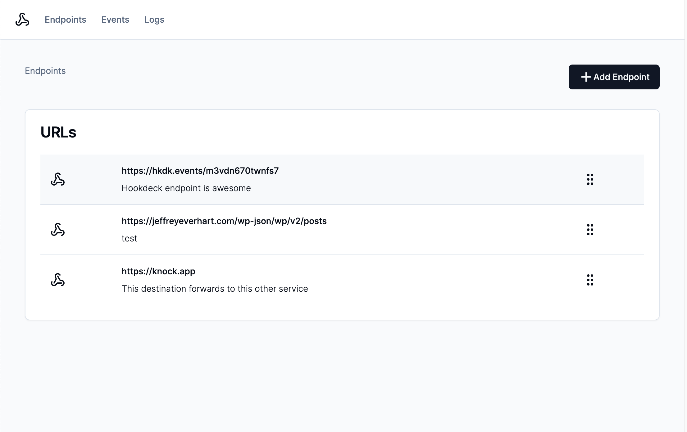
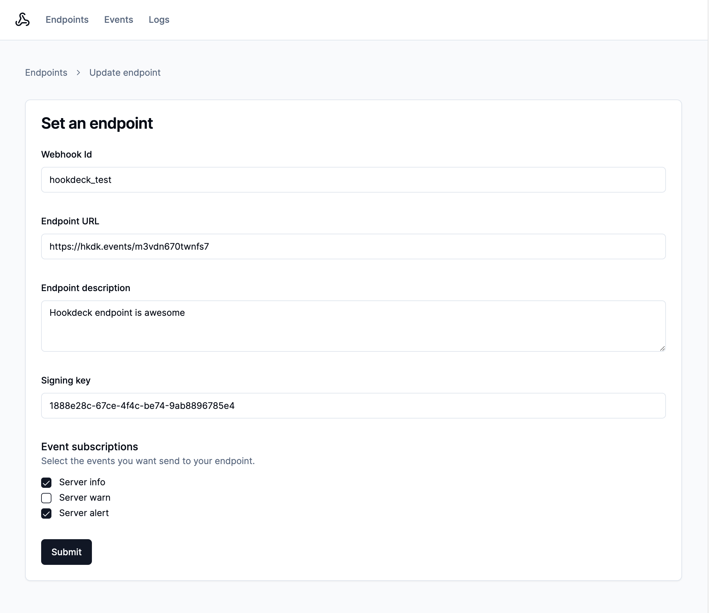
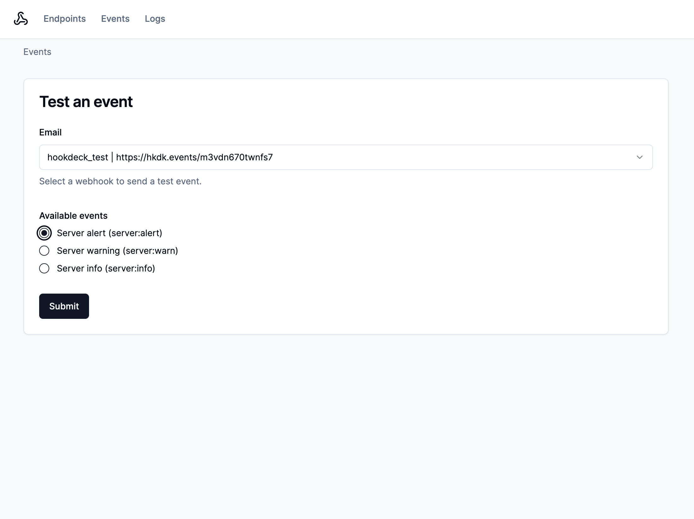
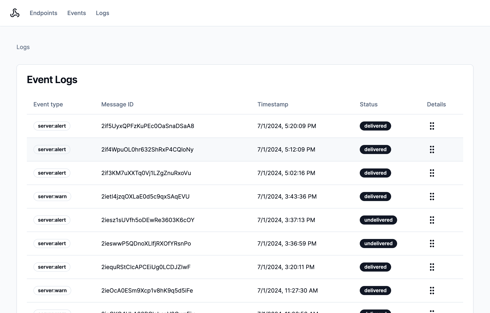
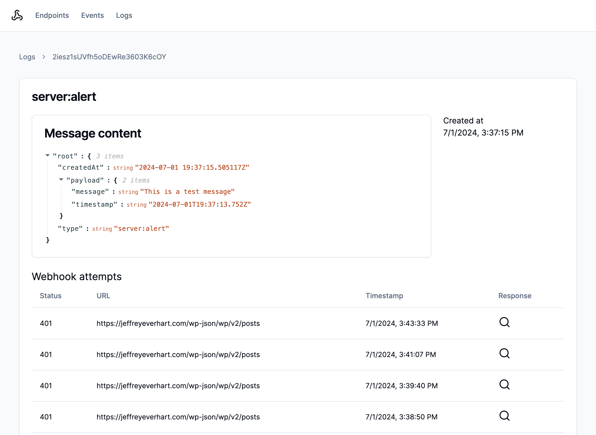

# Designing customer-facing webhooks with Knock

This example app builds on [this guide](https://docs.knock.app/guides/customer-webhooks) from the official docs. It provides you an easy way to implement the steps outlined there and demonstrates how to create a debugging logs for developers using Knock's APIs. The app itself is built using Next.js and shadcn/ui.



## Getting started

To get started, you'll first want to create a new copy of the `.env.sample` file to use in your project:

```bash
cp .env.sample .env.local
```

From here, you'll need to provide values for the following environment variables. You may also need to create a few resources in Knock.:
| Env Var | Description |
| ---------------------------------- | --------------------------------------------------------------------------------------------------------------------------------------------------------------------------------------------------------------------------------------------------------------------------------------------- |
| KNOCK_API_KEY | This value comes from Knock and is used to authenticate server-side API requests. You can find it listed as the secret key under "Developers" > "API keys." **This is a secret value and should not be exposed publicly.** |
| KNOCK_WEBHOOK_CHANNEL_ID | This value comes from Knock after you create a Webhook channel in the "Integrations" section of the dashboard. |
| KNOCK_WEBHOOK_COLLECTION | This value will provide the name for your collection of webhook configuration objects. You can use 'webhooks' as a default if you're using this as a PoC |
| KNOCK_WEBHOOK_WORKFLOW_KEY | This value comes from Knock after you create the workflow that will generate your webhook messages.  
| KNOCK_TENANT_ID | This value corresponds to a tenant in Knock, which may also be know as account or organization in your application data model. |

## Modeling webhook connections with objects in Knock

In this section, we will explore how to model webhook connections using objects in Knock. In Knock, you can think of [Objects](https://docs.knock.app/concepts/objects) as a NoSQL data store for non-user entities. In other words, you can create JSON-shaped entities inside of collections that map to parts of your application's data model.

In this app, we create an entity inside of the `webhooks` collection to store information about the webhook connection. Each `object` can have custom properties like a `url` or an array of `events` the webhook is subscribed to.



In this application, the `SetEndpointForm` component calls a server action that runs the following code to create or update our webhook endpoint entity:

```javascript
  const knock = new Knock(process.env.KNOCK_API_KEY);
  await knock.objects.set(
    process.env.KNOCK_WEBHOOK_COLLECTION as string,
    slugify(values.id),
    {
      name: values.id,
      description: values.description,
      url: values.endpointURL,
      signingKey: values.signingKey,
      events: values.events,
    }
  );
```

You can also use [objects to power subscriptions](https://docs.knock.app/concepts/objects#object-subscribers), which is a powerful pattern that simplifies triggering workflows.

## Triggering test events in Next.js with Knock workflows

In this section, we will learn how to trigger test events from Next.js by utilizing Knock workflows. Knock workflows are triggered using an API request or SDK method that contain a `recipient` that will receive the notification, payload `data` that can be used in the message template, as well as other optional properties like `tenant.`



The `TestEventForm` component calls a server action that triggers your workflow using the following code:

```javascript
  const knock = new Knock(process.env.KNOCK_API_KEY);
  const workflow_run_id = await knock.workflows.trigger(
    process.env.KNOCK_WEBHOOK_WORKFLOW_KEY as string,
    {
      recipients: [
        {
          id: values.webhookId,
          collection: process.env.KNOCK_WEBHOOK_COLLECTION as string,
        },
      ],
      data: {
        eventType: values.eventType,
        payload: {
          message: "This is a test message",
          timestamp: new Date().toISOString(),
        },
      },
      tenant: process.env.KNOCK_TENANT_ID as string,
    }
  );
```

First, we use the `KNOCK_WEBHOOK_WORKFLOW_KEY` environment variable to make sure we're triggering the correct workflow. Then, we provide the `id` and `collection` of the selected webhook connection as an entry in the `recipients` array. The `data` key is a JSON object that contains the custom payload for our webhooks, which contains an `eventType` that will be matched against allowed `events` on our webhook connection object and a `payload` object.

In this example, we also pass in a `tenant` to make it easier to query for webhook messages that belong to a particular organizations.

## Debugging webhook requests and responses with message delivery logs

In this section, we will dive into the importance of message delivery logs and how they can help us examine webhook requests and responses. Knock normalizes [message delivery status](https://docs.knock.app/send-notifications/message-statuses#delivery-status) across all types of message channels.



To list messages, you can use this SDK method to fetch them. You can provide [additional query options](https://docs.knock.app/reference#list-messages) to filter your results. In this example, the `tenant` option filters results to only the user's tenant, and then `source` and `channel_id` filter to a specific webhook channel and workflow:

```javascript
const knock = new Knock(process.env.KNOCK_API_KEY);
  let messages = null;
  try {
    messages = await knock.messages.list({
      tenant: process.env.KNOCK_TENANT_ID as string,
      source: process.env.KNOCK_WEBHOOK_WORKFLOW_KEY as string,
      channel_id: process.env.KNOCK_WEBHOOK_CHANNEL_ID as string,
    });
  } catch (e) {
    console.log(e);
  }
```

These message delivery statuses are valuable to developers using your webhooks, but they also might need to dig deeper if message delivery isn't successful. Knock provides access to an additional layer of details about message delivery using the [ message delivery log API](https://docs.knock.app/reference#get-message-delivery-logs).



These logs record important details about the HTTP request and response created from a webhook message channel. This allows the developer to inspect the interaction between Knock and their downstream service. At this time, there isn't an SDK method to fetch delivery logs, but you can use the API endpoint to fetch them:

```javascript
const knock = new Knock(process.env.KNOCK_API_KEY);
let message = null;
let deliveryLogs = null;
async function getMessageDeliveryLogs(id: string) {
  const results = await fetch(
    `https://api.knock.app/v1/messages/${id}/delivery_logs`,
    {
      headers: { Authorization: `Bearer ${process.env.KNOCK_API_KEY}` },
    }
  );
  return results.json();
}
try {
  const results = await Promise.all([
    knock.messages.get(params.logId),
    getMessageDeliveryLogs(params.logId),
  ]);
  [message, deliveryLogs] = results;
} catch (e) {
  console.log(e);
}
```

Once you have these delivery logs, you can use the `items` array to examine all of the different attempts Knock made to contact the downstream service. If the request was successful, there will most likely only be one item in this array.

You can see an example of how to construct an interface using this data in the `/app/logs/[logID]/page.tsx` file.
